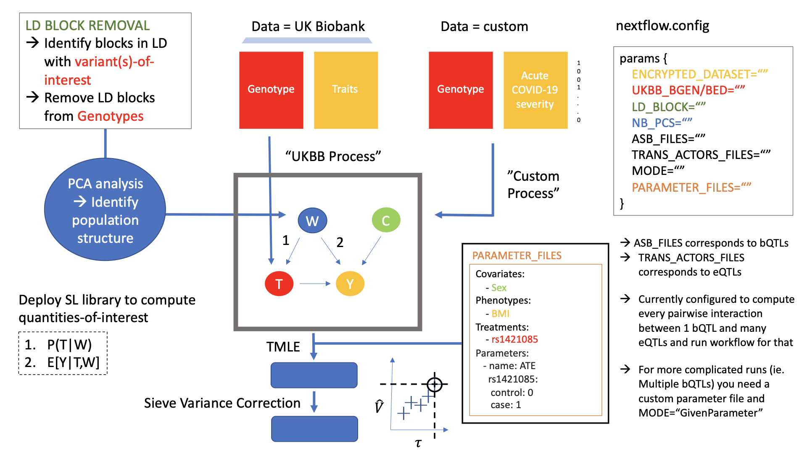

[](https://targene.github.io/targene-pipeline/stable/)


[](https://doi.org/10.21105/joss.09603)

# TarGene-Pipeline

TarGene is a Nextflow pipeline for the estimation of genetic effects on human traits using highly flexible semi-parametric inference methods (Targeted Minimum Loss-Based Estimation, One-Step Estimation). 



## Documentation Access

Want to know more? Please visit [the docs](https://targene.github.io/targene-pipeline/stable/).

## Running the Workflow

TarGene is a Nextflow pipeline, please refer to [their documentation](https://www.nextflow.io/) for general usage. The main point being that, depending on your HPC specifications, you will need to provide a specific `myplatform.config` configuration file on top of your project `myproject.config` configuration file.

```bash
nextflow run TARGENE/targene-pipeline -c myplatform.config -c myproject.config -resume
```

## Is TarGene for you?

If you would like to use flexible machine-learning methods while preserving valid statistical inference **and** your project falls within any of the following, then the answer is Yes!

Supported study designs:

- GWAS
- PheWAS
- Custom

Supported databases:

- UK Biobank
- All of Us
- Custom

Supported genetic effects:
- Main effects
- Interactions up to any order

## Getting in Touch & Contributing

Guidelines for reporting and contributing are available [here](https://targene.github.io/targene-pipeline/stable/developer_guide/contribution_guide/).

## Citing TarGene

If you use TarGene in your work, please consider citing us:

**BibTeX**

```BibTeX
@article{Labayle_TarGene_A_Nextflow_2026,
author = {Labayle, Olivier and Slaughter, Joshua and Roskams-Hieter, Breeshey and Tetley-Campbell, Kelsey and van der Laan, Mark J. and Ponting, Chris P. and Khamseh, Ava and Beentjes, Sjoerd Viktor},
doi = {10.21105/joss.09603},
journal = {Journal of Open Source Software},
month = mar,
number = {119},
pages = {9603},
title = {{TarGene: A Nextflow pipeline for the estimation of genetic effects on human traits via semi-parametric methods.}},
url = {https://joss.theoj.org/papers/10.21105/joss.09603},
volume = {11},
year = {2026}
}
```

**APA**

Labayle, O., Slaughter, J., Roskams-Hieter, B., Tetley-Campbell, K., van der Laan, M. J., Ponting, C. P., Khamseh, A., & Beentjes, S. V. (2026). TarGene: A Nextflow pipeline for the estimation of genetic effects on human traits via semi-parametric methods.. Journal of Open Source Software, 11(119), 9603. https://doi.org/10.21105/joss.09603


