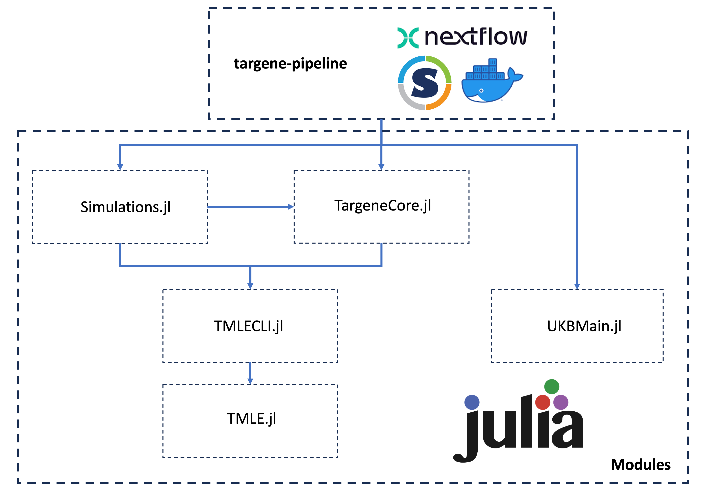

# Project Organization

The TarGene project is organized around the [targene-pipeline](https://github.com/TARGENE/targene-pipeline) repository which contains the [Nextflow](https://www.nextflow.io/) workflows. However, this repository does not contain the executables that are used by the Nextflow processes. Those executables originate from complementary repositories:

- [TargetedEstimation.jl](https://github.com/TARGENE/TargetedEstimation.jl)
- [TargeneCore.jl](https://github.com/TARGENE/TargeneCore.jl)
- [UKBMain.jl](https://github.com/TARGENE/UKBMain.jl)

The following diagram presents a high level perspective of the project's organization and dependence structure.

