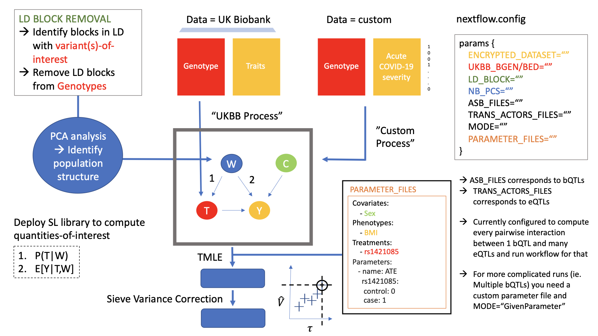

# TarGene

Welcome to TarGene, the software that brings Targeted Learning to population genetic studies! TarGene enables the estimation of various effect sizes including the Average Treatment Effect and the Interaction Average Treatment Effect (epistasis) up to any order. Because we follow the Targeted Learning framework, the final estimates provided by TarGene are covered by mathematical guarantees. The software is delivered as a [Nexflow](https://www.nextflow.io/) pipeline to bring scalability and reproducibility to your research.

## Overview of the pipeline

The pipeline can rougly be decoupled into three steps. The first, aims at pre-processing the data sources to convert them in a table data format that can be wielded by Targeted Maximum Likelihood Estimation (TMLE). The second is the TMLE itself. The third and final step is the Sieve Variance Plateau correction which revises the variance estimate to account for the fact that individuals in the population are not necessarily independent. The following diagram provides a high level interface of the organisation of the pipeline.

```@raw html
<div style="text-align:center">

</div>
```


## Quick start for Eddie users

If you are a University of Edinburgh researcher and have access to the Eddie cluster you may want to use the [Eddie-Template](https://github.com/TARGENE/Eddie-Template) to quickly setup your project. 


## Getting in touch

Please feel free to [raise an issue](https://github.com/TARGENE/targene-pipeline/issues) if you face a problem or would benefit from a new feature. Contributions are most welcome.
