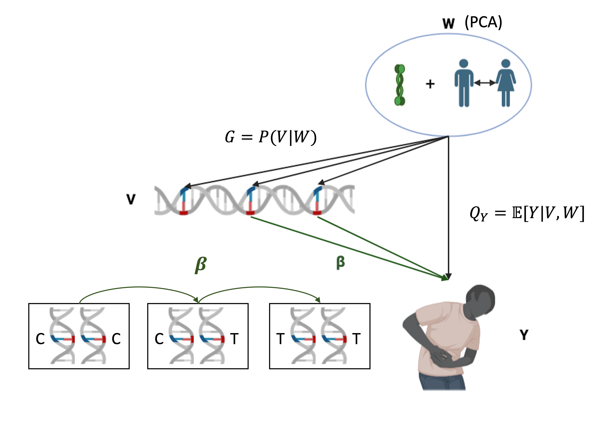

# TarGene

## What is TarGene?

TarGene is a [Nexflow](https://www.nextflow.io/) workflow that estimates the effect of genetic variations on human traits via Targeted Learning. Targeted Learning is a modern framework that combines advances in causal inference, machine-learning and statistical theory to answer impactful scientific questions. In population genetics, these questions are diverse: single variant effect, epistatic interactions, gene-environment interactions and more! In TarGene, we thus provide targeted estimators that leverage machine-learning algorithms to answer these questions, while preserving valid statistical inference.

In a nutshell, TarGene uses machine-learning models to estimate two predictive functions: the outcome model ``Q_Y`` and the propensity score ``G``. These models are then optimally combined to obtain a targeted estimate for the genetic effect of interest, which is here denoted by ``\beta``. Genetic effects are defined as causal quantities that measure they effect of change (but see below). The following picture illustrates two distinct genotype changes: ``\mathrm{CC} \rightarrow \mathrm{CT}`` and ``\mathrm{CT} \rightarrow \mathrm{TT}``. Note that there is no need for parametric assumption like linearity and flexible modelling strategies can be employed. However, linear models are also part of the machine-learning family, so you can use them as well if you like. You could actually combine multiple models in a more powerful [Super Learner](https://www.ncbi.nlm.nih.gov/pmc/articles/PMC6089257/), this is all integrated into TarGene.

!!! note "Causal Interpretation"
    The fact that genetic effects can be interpreted as causal effects is entirely dependent on the validity of the causal model, which rely on two critical assumptions
    1. No unobserved confounders. In TarGene, confounding variables are currently learnt via Principal Component Analysis. While PCA could partly capture genetic ancestry, the problem of [linkage disequilibrium](https://www.nature.com/articles/s43586-021-00056-9) remains.
    2. Positivity. This means that the genetic variants under investigation should have non-zero probability under all confounding variables values. In TarGene, we tackle this issue via a heuristic, which is similar to the usual minor allele frequency threshold employed in GWAS.

### What TarGene Can Do

TarGene provides baked-in facilities for most popular study designs that aim at understanding the effect of genetic variations on human traits. Hopefully you can find what you are looking for in the following list of supported study-designs:

- Genome-Wide Association Studies
- Phenome-Wide Association Studies
- Focused Study of:
    - Single or Joint variants effects
    - Gene-Gene interactions up to any order
    - Gene-Environment interactions up to any order

### What TarGene Can't Do (Yet)

Targeted Learning is extremly powerful because it provides taylored estimation strategies for each question of interest. Most of the questions that can be currently answered with statistical confidence are population level questions. That is, while TarGene uses predictive machine-learning models to estimate genetic effects, these predictive models are not the output of the software themselves. Furthermore, because each estimator is targeted, it means additional work must be done for each new question that comes up. For instance, one thing that TarGene can't do just yet is to estimate Heritability, but if you are interested we'd love to hear from you!

## Installation

Since TarGene is a Nextflow pipeline, all you need is:

- Nextflow >= 24.04.4

And one of:

- Singularity >= 3.8.6
- Docker >= 27.0.3

If you are executing TarGene on a High-Performance Computing platform, it is likely these software are already installed. Versions are indicative, any recent version should work.

## Citing TarGene

## References

- [Dispensing with unnecessary assumptions in population genetics analysis](https://www.biorxiv.org/content/10.1101/2022.09.12.507656v1).

## Getting in touch

Please feel free to [raise an issue](https://github.com/TARGENE/targene-pipeline/issues) if you face a problem or would benefit from a new feature. Contributions are most welcome.
