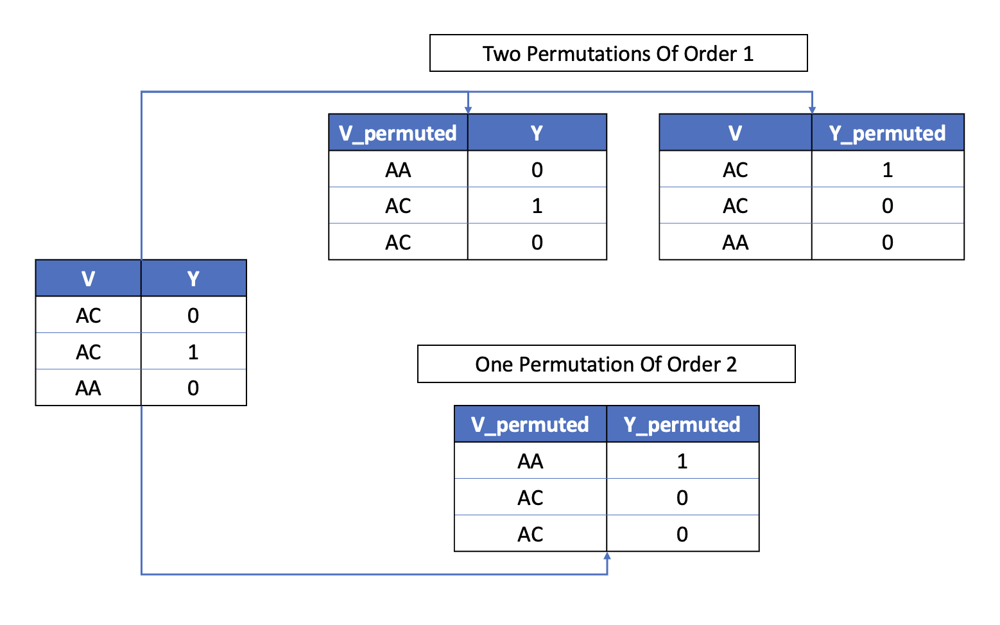

# The Permutation Test Workflow

An association is a deterministic link between a set of at least two variables, for example a genetic variant `V` and a trait `Y`. If we were to randomly shuffle the column `V` in the dataset, our expectation is that the association between `V` and `Y` will be altered. Obviously, there is nothing special about the variant `V`, we could also independently shuffle the column `Y` and expect the same result. These are termed order 1 permutations because only one column has been permuted. An equally valid order 2 permutation would shuffle both `V` and `Y` independently. The following picture displays the example:



In general for an association between ``K`` variables, there are ``1..K`` permutation orders. The Permutation Test Workflow generalizes this idea to all the associations passing a specific p-value threshold (`PVAL_THRESHOLD`) and induces all permutation orders given by `PERMUTATION_ORDERS`. It then runs the estimation workflow for the permuted estimands.

!!! note
    Of course, if we are unlucky, it could be that a given permutation will not completely alter an association. However, on average we should not deviate from the null hypothesis of no association. This can be checked via examination of the QQ plot generated by TarGene.

## Example Run Command

```bash
nextflow run https://github.com/TARGENE/targene-pipeline/ -r TAG -entry PERMUTATION_TEST -profile P -resume
```

## Configuration

### Main Outputs

The workflow will produce the following main outputs in the output directory (`OUTDIR`, defaults to `results`):

- An HDF5 file containing estimation results (`HDF5_OUTPUT`, default: results.hdf5)
- An optional JSON file containing estimation results (`JSON_OUTPUT`)
- A Quantile-Quantile summary plot: QQ.png

### Arguments

- **`RESULTS_FILE` (required)**: Path to an HDF5 results file generated by a previous TarGene run.
- **`AGGREGATED_DATASET` (required)**: Path to an aggregated dataset generated by a previous TarGene run.
- **`ESTIMATOR_FILE` (required)**: Estimator name or Julia file containing the description of the Targeted Estimators to use. To be consistent it should match the argument provided to the previous TarGene run.

### Main Options

- **`PERMUTATION_ORDERS` (optional, default: "1")**: A comma separating string defining the permutation test orders to be performed.
- **`POSITIVITY_CONSTRAINT` (optional, default: 0.01)**: When the list of estimands is generated or validated. Treatment variables' rarest configuration should have at least that frequency. For example if the treatment variables are two variants with minor allele A and T respectively. The rarest configuration will be (AA, TT) and should have a frequency of at least `POSITIVITY_CONSTRAINT`.
- **`PVAL_THRESHOLD` (optional, default: 0.05)**: Only results with a p-value below this threshold are considered for permutation testing.
- **`ESTIMATOR_KEY` (optional, default: TMLE)**: The p-value for `PVAL_THRESHOLD` is computed using the result from this estimator.
- **`MAX_PERMUTATION_ATTEMPTS` (optional, default: 1)**: When generating permutations across multiple columns, the permuted dataset could result in many positivity violations as defined by `POSITIVITY_CONSTRAINT`. Multiple attempts can be made to maximize the number of permutation estimands satisfying the positivity constraint.

### Secondary Options

- **`MAX_PERMUTATION_TESTS` (optional)**: If you have many discoveries, you may want to limit the number of performed permutation tests.
- **`RNG` (optional, default: 123)**: General random seed used to induce permutation.
- **`VERBOSITY` (optional, default: 0)**: Verbosity level of the the Workflow's processes.
- **`BATCH_SIZE` (optional, default: 400)**: The set of estimands to be estimated is batched and the Targeted Learning processes will run in parallel across batches.
- **`TL_SAVE_EVERY` (optional: default: 50)**: During the estimation process, results are appended to the file in chunks to free memory.
- **`KEEP_IC` (optional)**: To save the Influence Curves for each estimate. Depending on the size of your dataset, this can result in massive disk usage.
