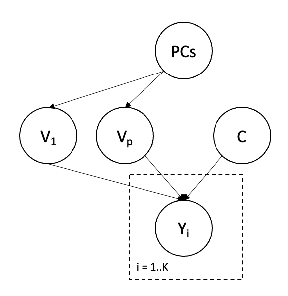

# Parameter specification

## Parameter Files

In this section, by parameter, we mean the statistical parameter that represents the scientific quantity of interest and will be estimated via TarGene. The complete specification of a parameter requires the description of a causal model which can be represented by the following graph.

```@raw html
<div style="text-align:center">

</div>
```

Parameters are specified by a YAML file with one section for each variable in the causal model and a section for the parameters that need to be estimated from this causal model. Here is a succinct description for each section and the behaviour of the pipeline for each variable:

- `Treatments`: The treatment variables, typically one or multiple SNPs and potential environmental exposures.
- `Confounders`: Confounding variables, typically the principal components which are computed by the pipeline. This section can (must) be ommited.
- `Covariates`: Additional covariates for the prediction of the traits. Not yet working and must be omitted.
- `Targets`: The traits of interest. The algorithm will loop through all traits in this section for the given treatments, confounders and covariates. This enables the reuse of the propensity score estimation. If this section is omitted (usually the case) all traits will be used.
- `Parameters`: For each target in `Targets` multiple parameters may be of interest depending on the exact case/control scenario of the treatment variables. For instance, since each genotyped locus can take up to 3 different values there could be up to 3 Average treatment Effect parameters if the treatment section consists of only one SNP.

Since an example may be worth a thousand words, here are a couple of such files.

### Average Treatment Effect

One SNP `RSID_10` and 2 ATEs for all traits under study.

```yaml
Treatments:
  - RSID_10
Parameters:
  - name: GG_TO_AG
    RSID_10:
      control: GG
      case: AG
  - name: GG_TO_AA
    RSID_10:
      control: GG
      case: AA
```

### Interaction Average Treatment Effect

Two interacting SNPs `RSID_10` and `RSID_100` with only one target `PHENOTYPE_1` and only one parameter.

```yaml
Treatments:
  - RSID_10
  - RSID_100

Targets:
  - PHENOTYPE_1

Parameters:
  - name: IATE
    RSID_10:
      control: GG
      case: AG
    RSID_100:
      control: GG
      case: AG
```

## Parameter strategies

There are two main ways one can specify parameters that need to be estimated during a targene-pipeline run. This is done via the `MODE` parameter.

- `MODE` = `GivenParameters`

In this setting, one typically write by "hand" or generate a set of parameter files as described above. The path to those parameters is then provided with the `PARAMETER_FILES` nextflow parameter.

- `MODE` = `ASBxTransActors`

It is assumed that an initial set of variants has been pre-identified from a previous allele-specific binding (ASB) study as output by the [ball-nf](https://git.ecdf.ed.ac.uk/oalmelid/baal-nf) pipeline: `ASB_FILES` parameter. It is also assumed that another set of potential trans-actors is given in a .csv file: `TRANS_ACTORS_FILE` parameter. In that scenario, the target parameter will be the Interaction Average Treatment Effect between every pair of SNPs. Additionally, if template parameters configuration files containing extra treatments are provided (via `PARAMETER_FILES`), nth-order interaction parameters will be generated.

## Parallelization

Since the same estimator for `p(T|W)` can be used for multiple target parameters, it may be useful to batch phenotypes using `PHENOTYPES_BATCH_SIZE`(default: 1) in order to reduce the computational burden.
