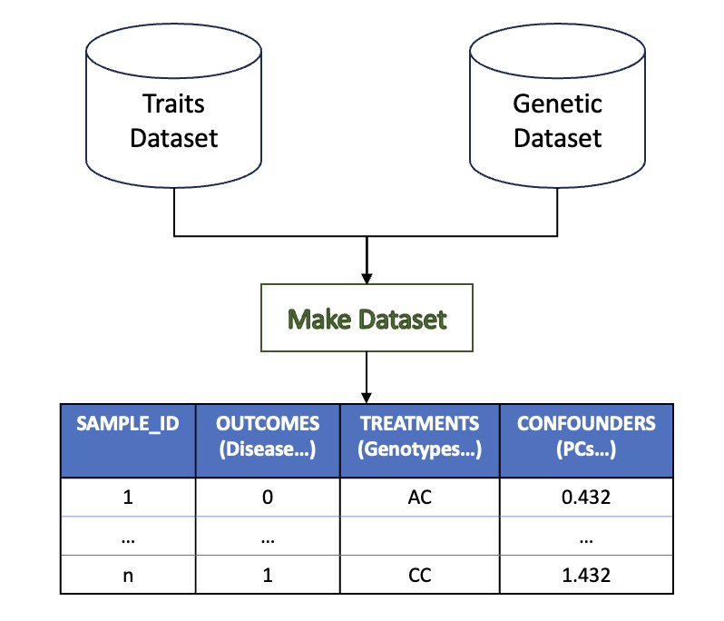

# The Make Dataset Workflow

This workflow extracts an aggregated dataset containing traits (`TRAITS_DATASET`), genetic confounders (`NB_PCS`) and genetic variants (`VARIANTS_LIST`) in an Arrow tabular format.



## Example Run Command

```bash
nextflow run https://github.com/TARGENE/targene-pipeline/ -r TAG -entry MAKE_DATASET -profile P -resume
```

## List Of Workflow Arguments

- **`VARIANTS_LIST` (required)**: A text file (one rsid per line) specifying the variants of interest.
- **`BGEN_FILES` (required)**: Path to imputed BGEN files from which the variants in `VARIANTS_LIST` will be extracted.
- **`NB_PCS` (optional, default: 6)**: The number of PCA components to extract.
- **`BED_FILES` (required)**: Path expression to PLINK BED files.
- **`COHORT` (optional: "UKB")**: Current default for this is UKB. If set to a value other than UKB, this will not run UKB-specific trait extraction.
- **`TRAITS_DATASET` (required)**: Path to a traits dataset. If you are running this for a non-UKB cohort, your sample IDs must be specified in the first column of this CSV file, with the column name `SAMPLE_ID`.
- **`FLASHPCA_EXCLUSION_REGIONS` (optional, default: assets/exclusion_regions_hg19.txt)**: A path to the flashpca special exclusion regions.
- **`MAF_THRESHOLD` (optional, default: 0.01)**: Only variants with that minor allele frequency are considered
- **`LD_BLOCKS` (optional)**: A path to pre-identified linkage disequlibrium blocks to be removed from the BED files. It is good practice to specify `LD_BLOCKS`, as it will remove SNPs correlated with your variants-of-interest before running PCA.

**If the `COHORT` argument is set to `UKB`**:

- **`UKB_CONFIG` (required)**: YAML configuration file describing which traits should be extracted and how the population should be subsetted.
- **`UKB_ENCODING_FILE` (optional)**: If the `TRAITS_DATASET` is encrypted, an encoding file must be provided.
- **`UKB_WITHDRAWAL_LIST` (optional)**: List of participants withdrawn from the study.
- **`QC_FILE` (optional)**: Genotyping quality control file from the UK-Biobank study.
