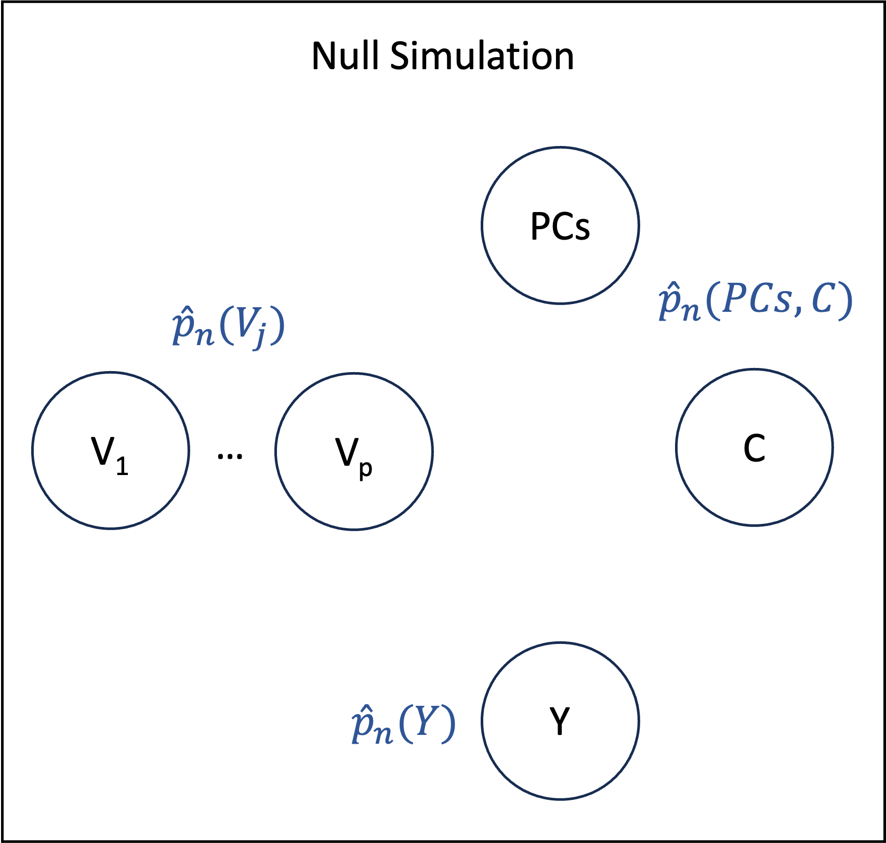

# Null Simulation

## Motivation

The goal of the Null Generating Process is to result in the theoretical null hypothesis of "no effect". The main rationale behind this simulation is that most of the genome is still believed to be irrelevant. It is thus of particular importance that the proposed semi-parametric estimators are not too sensitive to noise in order to control the false discovery rate. Since we are interested in the effects of genetic variants on traits, the data generating process must satisfy: ``\forall j, Y \indep V_j``, where ``Y`` is a given trait. In practice, we enforce an even stronger condition, where all variables are pairwise independent. This is done by drawing independently ``n`` samples with replacement from the empirical marginal distribution of each variable. The only exception is that ``(PCs, C)`` are sampled jointly. This generating process hence preserves many characteristics of the original dataset, while resulting in the Null hypothesis.



## Running the Workflow

To run the null simulation, the `NULL_SIMULATION` entry should be added to the Nextflow command-line as follows

```bash
nextflow run https://github.com/TARGENE/targene-pipeline/ -r v0.11.0 -entry NULL_SIMULATION
```
