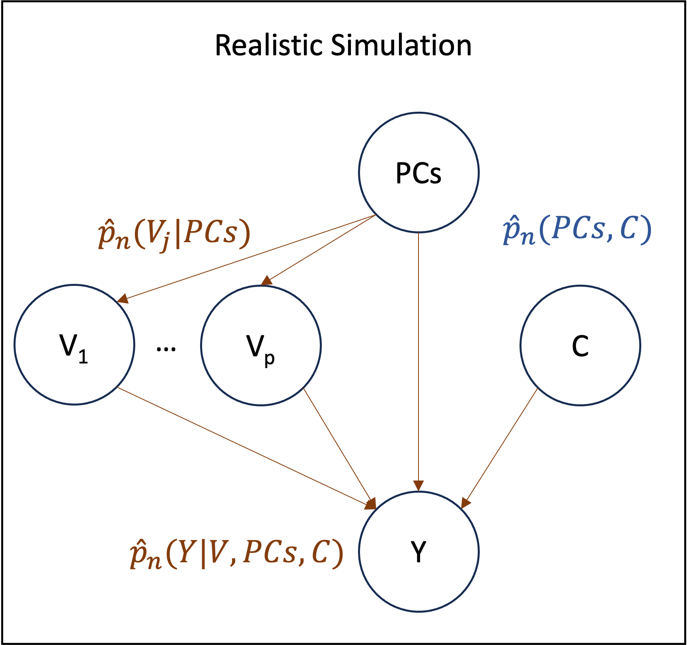

# Realistic Simulation

## Motivation

In order to understand how well semi-parametric estimators will perform in real-world scenarios, we aim to simulate new data which is as close as possible to the original dataset. For each estimand of interest, we assume a causal graph similar to that of the following figure.



Each estimand is thus associated with a natural generating process, or equivalently, set of densities. For example, the interaction of ``(V_1, V_2)`` on ``Y`` requires three density estimates, namely: ``\hat{P}_n(V_1|PCs)``, ``\hat{P}_n(V_2|PCs)`` and ``\hat{P}_n(Y|V_1, V_2, PCs, C)``. Similarly, the single variant effect of ``V_1`` on ``Y`` requires: ``\hat{P}_n(V_1|PCs)`` and ``\hat{P}_n(Y|V_1, PCs, C)``. Once these conditional densities have been estimated, new data can be generated via ancestral sampling. Implicitly, the empirical distribution ``\hat{P}_n(PCs, C)`` is always used to sample from the root nodes.

For the simulation to be realistic, the conditional density estimators must be able to capture the complexity of the data, which has two main implications. The first is that the Causal Model should include as many causal variables as possible to generate the corresponding children variables. The second is that the density estimators must be flexible and data adaptive to capture arbitrarily complex data generating processes.

## Variable Selection

Ideally, we would include the set of all genetic variants within the model and let it decide which ones are important in a data driven way. This is the approach taken by [REGENIE](https://rgcgithub.github.io/regenie/), and integrating this idea within TarGene is an interesting direction. At the present moment though we restrict the dimensionality of the problem and only consider a small subset of these putative causes. This is done using published GWAS results from the [geneATLAS](http://geneatlas.roslin.ed.ac.uk/). Precisely, we sub-sample a maximum of `GA_MAX_VARIANTS (default: 50)` variants from all variants associated with the outcome of interest (`GA_PVAL_THRESHOLD (default: 1e-5)`). Furthermore, these variants must be at least `GA_DISTANCE_THRESHOLD (default: 1000000)` base pairs away from each other and have a minor allele frequency of at least `GA_MAF_THRESHOLD (default: 0.01)`. With respect to the above figure, these sub-sampled variants are assumed to be contained within the ``C`` variables.

## Density Estimation

The second requirement for the simulation to be realistic is that the density estimators should capture complex patterns, which means the model class must be large. Neural networks, have been shown to be able to approximate a large class of function and scale seamlessly to large datasets. We thus used two types of neural networks depending on the type of the density's outcome variable. For categorical variables, including binary outcomes, a multi-layer perceptron is used, while for continuous variables we used a mixture density network. In all cases, in order to prevent over-fitting, density estimators are trained as sieve estimators. That is, the size of the model is chosen data adaptively by sequentially increasing the model capacity and early-stopping based on cross-validation performance.

## Running the Workflow

To run the null simulation, the `REALISTIC_SIMULATION` entry should be added to the Nextflow command-line as follows

```bash
nextflow run https://github.com/TARGENE/targene-pipeline/ -r v0.12.0 -entry REALISTIC_SIMULATION
```

## Output

The output is a "realistic\_simulation\_results.hdf5" file (see [Description of Simulations Outputs](@ref)).
