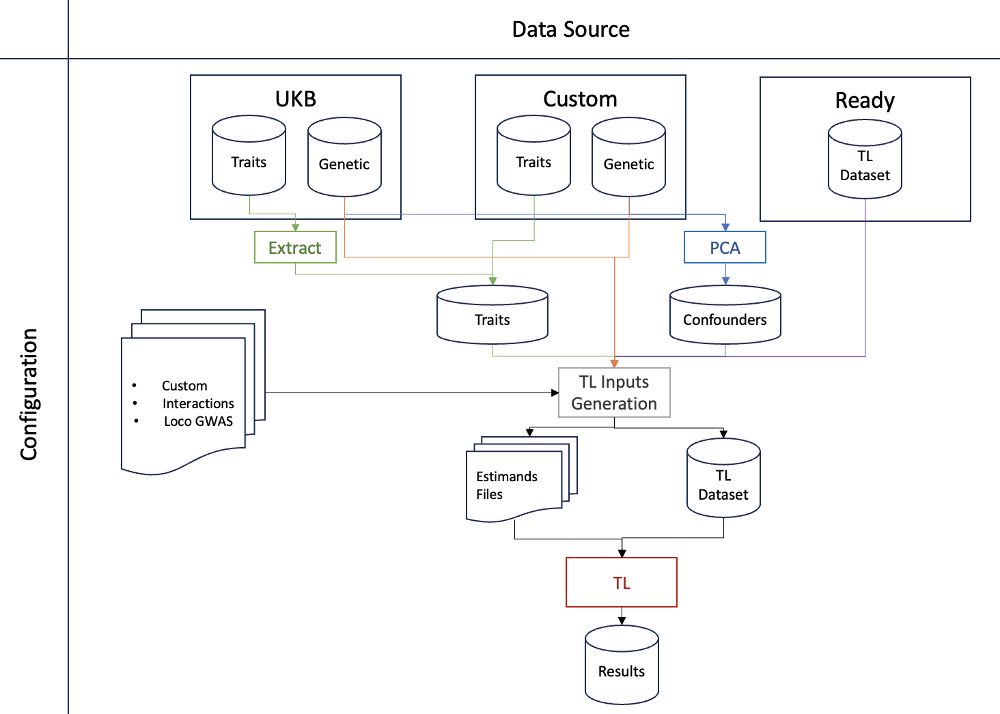

# The TarGene Workflow

## Overview

The main purpose of the TarGene workflow is to estimate a wide variety of genetic effect sizes using the Targeted Learning framework. Contrary to a GWAS setting, this workflow assumes that a set of genetic variants and/or environmental variables have been pre-identified and are provided as an input to the workflow. The workflow can be roughly decomposed into three main steps:

1. In the first step, all data sources are brought together to build:

   - An aggregated dataset containing all variables in an Arrow tabular format.
   - A set of estimands files that contain all the effect sizes to be estimated.

2. In the second step all effect sizes are estimated via Targeted Learning in a parallel manner across the generated estimands files. Results are then merged into a single file.
3. Finally, an optional Sieve Variance Plateau correction of the variance estimates is performed.

An overview of the workflow is presented in the following diagram.



## Example Run Command

```bash
nextflow run https://github.com/TARGENE/targene-pipeline/ -r TAG -entry TARGENE -profile P -resume
```

## Content

- [Setting a data source](@ref)
- [Adjusting for confounders](@ref)
- [Study Designs](@ref)
- [Specifying a Targeted Estimator](@ref)
- [Correcting for population relatedness](@ref)
- [Tweaking additional behaviour](@ref)