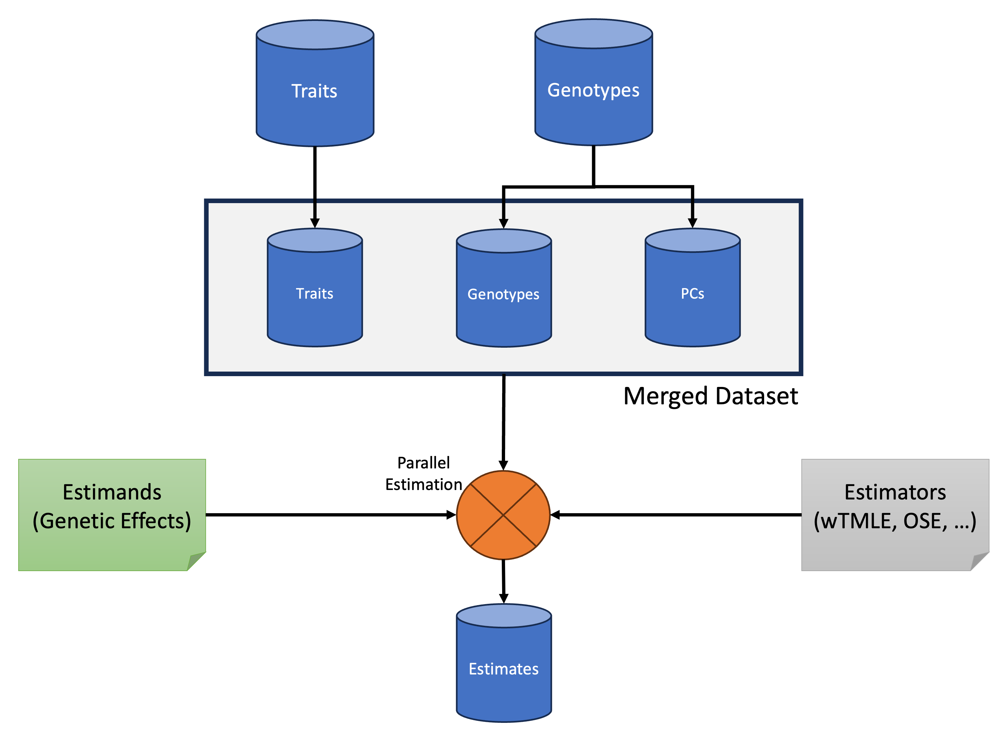

# The Discovery Workflow

## Overview

This is the main workflow within TarGene, its purpose is to estimate a wide variety of genetic effects using Targeted Learning. This is an end-to-end workflow, meaning that you don't need to perform any QC on your genotypes files. The workflow can be roughly decomposed into three main steps:

1. In the first step, all data sources are brought together to build:
   - An aggregated dataset containing all variables in an Arrow tabular format.
   - A set of estimands files that contain all the effect sizes to be estimated.
2. In the second step all effect sizes are estimated via Targeted Learning in parallel across the generated estimands files.
3. In the third step, results are aggregated into summary files and a Q-Q plot is generated.
4. A fourth, optional step constructs Sieve Variance Plateau correction of the variance estimates to account for potential population relatedness.

An overview of the workflow is presented in the following diagram.



## Example Run Command

```bash
nextflow run https://github.com/TARGENE/targene-pipeline/ -r v0.11.0 -profile local -resume
```

We now describe step by step how to setup a TarGene run configuration.
