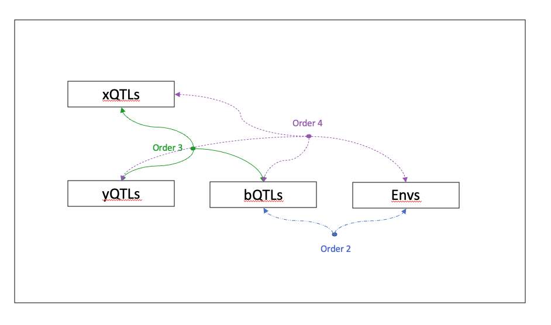

# Study Designs

A study design describes what are the questions of interest for a given TarGene run. In particular, it answers the two following questions:

- What variants are of interest?
- What are the quantities of interest: Average Treatment Effects, Epistatic Interactions, Gene by Environment Interactions, ...?

While specifying your estimands, it may be useful to keep the following causal model in mind.


Where ``V_1...V_p`` are a set of genetic variants, the ``Y_1...Y_K`` are a set of traits and ``C`` are a set of additional predictors for ``Y`` but not confounding the genetic effects.

The following sections describe the available study designs available in TarGene.

## `CUSTOM`

This is the most general setting and should match the needs of any project, however it requires some preliminary work. In this setting, one typically provides a file containing a list of the estimands of interest. If you are interested in only a few estimands, it may be acceptable to write them by hand. Otherwise it is best to generate them using a programming language (for instance using [TMLE.jl](https://targene.github.io/TMLE.jl/stable/)). The path to those estimands is then provided with the `ESTIMANDS_FILE` nextflow parameter. Estimands are specified via a YAML file as follows:

```yaml
type: "Configuration"
estimands:
  - outcome_extra_covariates: []
    type: "ATE"
    treatment_values:
      3:3502414:T:C:
        case: "TT"
        control: "CT"
      1:238411180:T:C:
        case: "TC"
        control: "TT"
    outcome: ALL
    treatment_confounders: []
  - outcome_extra_covariates: []
    type: "IATE"
    treatment_values:
      3:3502414:T:C:
        case: "TT"
        control: "CT"
      1:238411180:T:C:
        case: "TC"
        control: "TT"
    outcome: ALL
    treatment_confounders:
      3:3502414:T:C: []
      1:238411180:T:C: []
  - outcome_extra_covariates: []
    type: "CM"
    treatment_values:
      3:3502414:T:C: "CT"
      1:238411180:T:C: "TC"
    outcome: ALL
    treatment_confounders:
      3:3502414:T:C: []
      1:238411180:T:C: []
  - outcome_extra_covariates: []
    type: "ATE"
    treatment_values:
      2:14983:G:A:
        case: "GG"
        control: "AG"
    outcome: ALL
    treatment_confounders: []
  - outcome_extra_covariates: []
    type: "CM"
    treatment_values:
      2:14983:G:A: "AG"
    outcome: ALL
    treatment_confounders: []
```

For each estimand:

- `type`: refers to the type of effect size:
  - ATE: Average Treatment Effect
  - IATE: Interaction Average Treatment Effect
  - CM: Conditional Mean
- `outcome`: The trait of interest. If using the Uk-Biobank datasource it must match the `phenotypes/name` field in the associated `UKB_CONFIG` file. You can also use the wildcard "ALL" to specify that you want to estimate this parameter accross all traits in the dataset.
- `treatment_values`: For each treatment variable (genetic-variant / environmental variables), the control/case contrasts.
- `treatment_confounders`: If each treatment's set of confounding variables is assumed to be the same, it can be a list of these variables. Otherwise, for each treatment variable, a list of confounding variables. Note that principal components will be added to that list automatically and must not be provided here. You can provide an empty list.
- `outcome_extra_covariates`: This is optional and correspond to a list of additional covariates for the prediction of the trait.

Note that variants must be encoded via an explicit genotype string representation (e.g. "AC"), the order of the alleles in the genotype is not important.

## `ALLELE_INDEPENDENT`

This mode will generate all estimands corresponding to the provided `ESTIMANDS_FILE`. In this case, this file is a plain YAML file as follows:

```yaml
orders: [2, 3]
estimands:
  - IATE
variants:
  TF1:
    bQTLs:
      - RSID_17
      - RSID_99
    eQTLs:
      - RSID_102
  TF2:
    bQTLs:
      - RSID_17
      - RSID_198
    eQTLs:
      - RSID_2
extra_treatments:
  - TREAT_1
outcome_extra_covariates:
  - COV_1
extra_confounders:
  - 21003
  - 22001
```

where:
- `orders`: If more than 2 treatment variables are provided, interactions can be of order greater than 2.
- `estimands`: The type of generated estimands (only interactions `IATE` for now)
- `variants`: Two nested levels of variant groups. For each top level group, the Cartesian product of variants in each subgroup is produced.
- `extra_treatments`: These are added to the treatments combinations.
- `outcome_extra_covariates`: Additional covariates predictive of the outcomes
- `extra_confounders`: Confounding variables other than Principal Components.

## `FROM_ACTORS`

In this setting the goal is to infer the interaction effect between multiple variants and potential external factors, interacting together via a specific biological mechanism. Typically, multiple sets of variants are of interest and each set is identified with a specific molecule, contributing to the mechanism. In particular, it is assumed that a set of variants, usually binding quantitative trait loci (bQTLs) play a pivotal role. All interactions of interest are thus defined with respect to that set of genetic variations. Let's Consider the following scenario: we know that a transcription factor binds to molecules `x` and `y` and then differentially binds to specific regions in the genome (`bQTLs`) to regulate downstream genes. We suspect that an alteration of this mechanism is responsible for some diseases. A set of `xQTLs`, associated with the expression of `x` and a set of `yQTLs` associated with the expression of `y` have been identified. Together `xQTLs` and `yQTLs` variants are termed "trans actors". We further suspect that some environmental factors may influence this process. From that scenario, there are many questions that can be asked, for instance : "What is the interaction effects of a bQTL with an environmental factor?". This is a simple pairwise interaction setting and more complex scenarios can be envisaged as described in the following graph.

```@raw html
<div style="text-align:center">

</div>
```

Let us now turn to the pipeline specification for this parameter plan:

- `BQTLS`: A path to a `.csv` file containing at least an `ID` column for each rsID and an optional `CHR` column for the chromosome on which the SNP is located.
- `TRANS_ACTORS`: A path prefix to a set of `.csv` files identifying different trans-acting variants. Each file has the same format as for the `bQTLs`.
- `ENVIRONMENTALS`: A path to a `.txt` file containing a list of environmental exposures with no header and one exposure per line. Each exposure should be available from the trait dataset.
- `EXTRA_COVARIATES`: A path to a `.txt` file containing a list of extra covariate variables with no header and one variable per line. Each variable should be available from the trait dataset.
- `EXTRA_CONFOUNDERS`: A path to a `.txt` file containing a list of extra confounding variables with no header and one variable per line. Each variable should be available from the trait dataset.
- `ORDERS`: A comma separated string that specifies the various interaction orders of interest. All combinations satisfying the positivity constraint will be generated. The order 1 corresponds to the Average Treatment Effect (ATE) for `bQTLs`, any higher order corresponds to the Interaction Average Treatment Effect (IATE) for the various actors. For example, in the previous scenario, assume we provided `ORDERS`=`1,2`. This would generate parameter files for the estimation of all:
  - ATEs estimands for all bQTLs
  - IATEs estimands for all (bQTLs, xQTLs), (bQTLs, yQTLs), (bQTLs, Envs) pairs.
